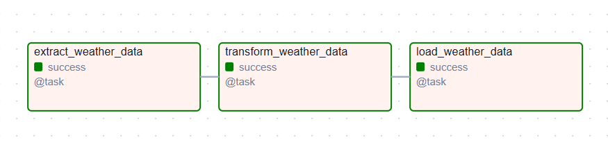
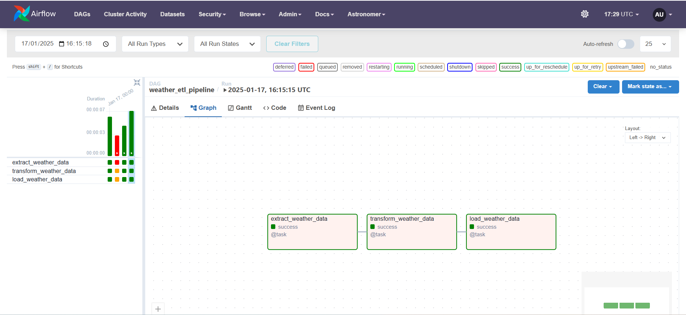

# Weather ETL Pipeline

This project demonstrates an automated **ETL (Extract, Transform, Load)** pipeline using **Apache Airflow**, orchestrated within a **Dockerized environment** powered by **Astronomer (Astro)**. The pipeline extracts real-time weather data from the Open-Meteo API, transforms it into a structured format, and loads it into a PostgreSQL database for storage and analysis.



---

## Features
- **Extract**: Retrieves real-time weather data (temperature, windspeed, weather code, etc.) for a given location using the Open-Meteo API. (For our case, our location is Tunisia)
- **Transform**: Cleans and structures the data for easy storage and analysis.
- **Load**: Inserts the transformed data into a PostgreSQL database.
- **Orchestration with Apache Airflow**: Handles task scheduling and monitoring.
- **Dockerized Environment**: Simplifies setup and ensures reproducibility using **Astronomer**.

---

## Understanding the Tools

### **1. Apache Airflow**
Apache Airflow is an open-source platform to programmatically author, schedule, and monitor workflows (DAGs – Directed Acyclic Graphs). In this project:
- **Airflow DAG**: A Python script defines the workflow of the ETL pipeline. Each step (extract, transform, load) is a task in the DAG.
- **Task Scheduling**: The pipeline runs daily (`@daily` schedule interval) to fetch updated weather data.
- **Web Interface**: Airflow provides a UI to visualize the workflow, monitor task execution, and debug failures.

**Why Airflow?**
Airflow is ideal for data pipelines because it:
- Provides task dependency management.
- Offers retry mechanisms for failed tasks.
- Allows dynamic workflows to adapt based on input data or parameters.

### **2. Astronomer (Astro)**
Astronomer is a managed service for Apache Airflow, offering tools to simplify:
- Setting up Airflow locally using **Astro CLI**.
- Running Airflow in Docker containers for portability.
- Deploying workflows in production environments.

**Astro CLI** commands make it easy to:
- Start the Airflow environment: `astro dev start`
- Access the Airflow UI locally: `http://localhost:8080`
- Stop the environment: `astro dev stop`

### **3. Docker**
Docker ensures that the entire project (Airflow, PostgreSQL, and your pipeline code) runs in isolated, reproducible containers. The provided `docker-compose.yaml` defines:
- A PostgreSQL database container (`postgres_db`).
- Airflow containers for the web server, scheduler, and worker.

---

## Setup and Usage

### **Prerequisites**
- [Docker Desktop](https://www.docker.com/)
- [Astronomer CLI](https://www.astronomer.io/docs/astro-cli/install)
- Python 3.8+ (for local development)

### **Installation Steps**
1. Clone the repository:
   ```bash
   git clone https://github.com/meriamcherif/weather-etl-pipeline-airflow.git
   cd etlweather
1. Clone the repository:
   ```bash
   git clone https://github.com/meriamcherif/weather-etl-pipeline-airflow.git
   cd etlweather
2. Start the Airflow environment:
astro dev start

3. Trigger the DAG

4. Check PostgreSQL Data:
Connect to the PostgreSQL database using a client like pgAdmin or via the terminal.
Query the weather_data table

### Airflow DAG Overview


